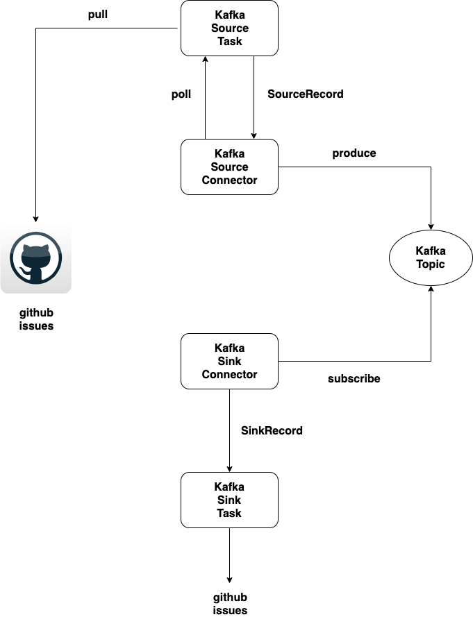

# Kafka Connect Round Trip Serialization/Deserialization

This repository contains a Kafka Source Connector and a Kafka Sink Connector implementation and illustrates round-trip serialization/deserialization of Github issues from a Github repository, into Kafka Topic and eventually consumed and deserialized back to Issue objects.

Issue on the Github repository will be pulled by Source Connector on a regular basis and Kafka messages are created from that and published to a Kafka Topic.

A Sink Connector is also setup to subscribe to that topic and produce Issue Java objects 




 ## Prerequisite
 
 * Java 8
 * Kafka 2.2.1 and up
 
 ## Build
 
```
mvn clean install
```

## Environment Variable

* For Source Task, in order to access Github repository, an access token is needed to call Github API to retrieve issues.

```
export GITHUB_ACCESS_TOKEN=XXXXXXX
```

* Kafka is assumed to be available at **$KAFKA_HOME**

## Execute

### Running Zookeeper

```
$KAFKA_HOME/bin/zookeeper-server-start.sh config/zookeeper.properties
```

### Running Kafka

```
$KAFKA_HOME/bin/kafka-server-start.sh config/server.properties
```

### Source Connector
```
cd source-connector
bash source.sh
```

### Sink Connector
```
cd sink-connector
bash sink.sh
```